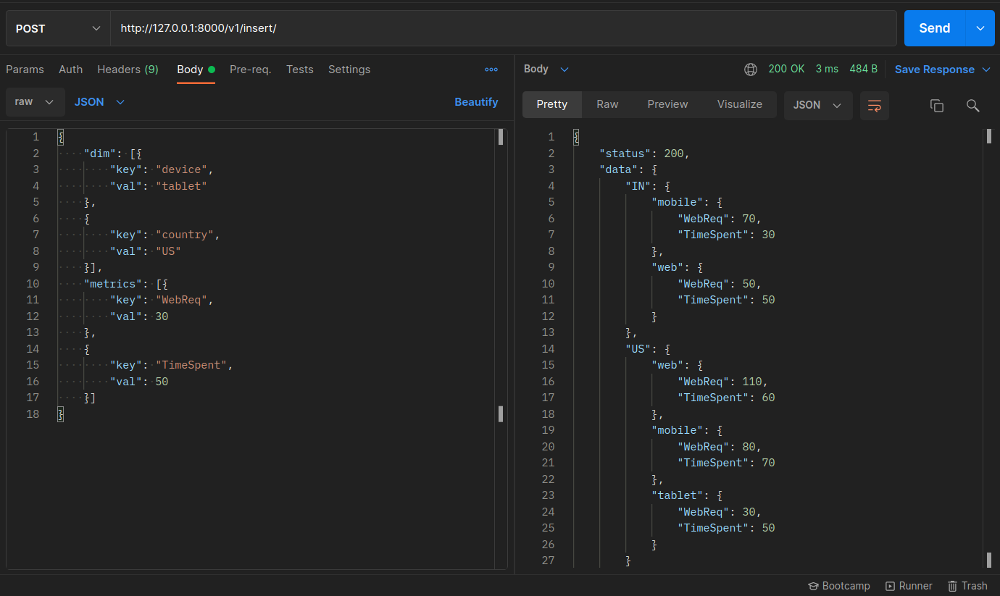
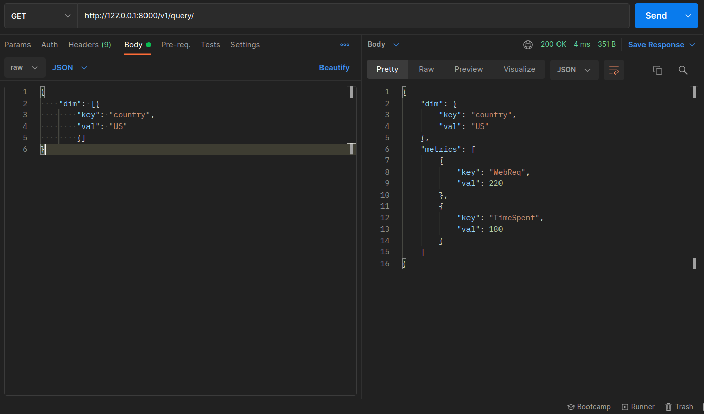

## Data Collection Tree
-----------

### Steps to run Docker image
1. Login to your docker account
    `sudo docker login`
2. Pull the image from dockerhub
    `sudo docker pull audaryauttarwar/data-collection-tree`
3.  Run the image
    `sudo docker run -p 8000:8000 audaryauttarwar/data-collection-tree:latest`

-----

The repo contains Postman collection `Data Collections Tree.postman_collection.json` which can be imported to test working of the project.
